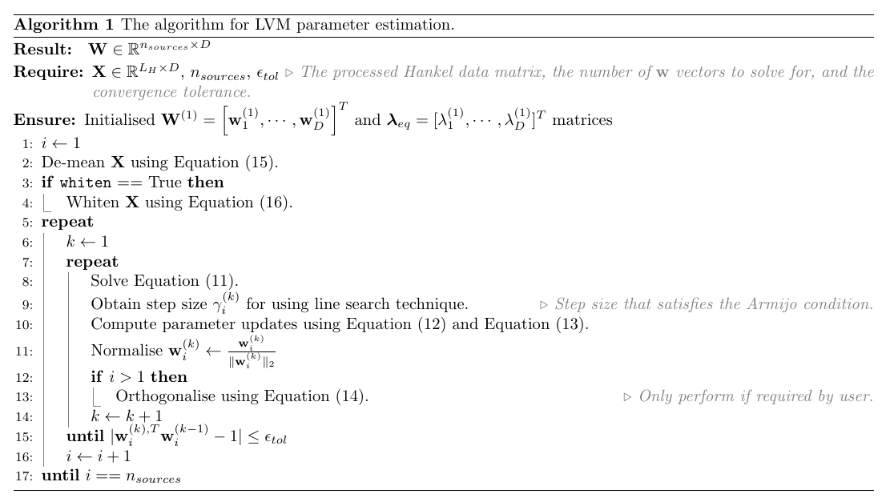

====================
Parameter estimation
====================

The objective of this section is to provide detail on the proposed spectral regularisation term, the optimisation framework followed, and combine this into a final parameter estimation framework.

Part one: The spectral regularisation term
==========================================

The proposed spectral regularisation term uses the Fourier transform of the source vectors to enforce spectral orthogonality. Given some column vector :math:`\mathbf{w} \in \mathbb{R}^{D}`, the Fourier representation of the vector can be computed using

.. math::
    \mathcal{F}(\mathbf{w}) = \mathbf{D} \mathbf{w}

where :math:`\mathcal{F}` represents the Fourier operator and :math:`\mathbf{D}` represents the discrete Fourier transform (DFT) matrix. The DFT matrix :math:`\mathbf{D} \in \mathbb{R}^{D \times D}` is given as

.. math::
    :label: dft-transform

	\begin{align}
		& \mathbf{D} = \frac{1}{\sqrt{D}} \mathbf{B} \\
		&= \frac{1}{\sqrt{D}}
		\begin{bmatrix}
			1 & 1 & 1 & 1 & \cdots & 1 \\
			1 & \omega & \omega^2 & \omega^3 & \cdots & \omega^{D - 1} \\
			1 & \omega^2 & \omega^4 & \omega^6 & \cdots & \omega^{2 \cdot \left(D - 1\right)} \\
			1 & \omega^3 & \omega^6 & \omega^9 & \cdots & \omega^{3 \cdot \left(D - 1\right)} \\
			\vdots & \vdots & \vdots & \ddots & \vdots \\
			1 & \omega^{D - 1} & \omega^{2 \cdot \left(D - 1\right)} & \omega^{3 \cdot \left(D - 1\right)} & \cdots & \omega^{\left(D - 1\right) \cdot \left(D - 1\right)}
		\end{bmatrix}\\
		&= \frac{1}{\sqrt{D}} \left(\mathbf{R} + \sqrt{-1} \cdot \mathbf{I} \right)
	\end{align}

where :math:`\omega = e^{-2 \cdot \pi \cdot \sqrt{-1} / D} = \sin\left( 2 \cdot \pi / D \right) - \sqrt{-1} \cdot \cos\left( 2 \cdot \pi / D \right)` is the primitive :math:`D^{th}` root of unity, :math:`\sqrt{-1}` defines an imaginary number, and :math:`\mathbf{R}\in \mathbb{R}^{D \times D} = [\mathbf{r}_1, \cdots, \mathbf{r}_D]` and :math:`\mathbf{I}\in \mathbb{R}^{D \times D} = [\mathbf{i}_1, \cdots, \mathbf{i}_D]` represent the real and imaginary components of :math:`\mathbf{B}` respectively. Note that the factor :math:`1/\sqrt{D}` in Equation :eq:`dft-transform` ensures that the DFT transform is unitary. The square of the complex modulus for the :math:`i^{th}` component in :math:`\mathcal{F}(\mathbf{w})` may be represented in index notation as

.. math::

    \begin{align}
		b_i(\mathbf{w}) &= \vert \mathcal{F}_i(\mathbf{w}) \vert^2 \\
		&= \left\lvert \frac{1}{\sqrt{D}} \left(\sum_{j} R_{ij} \cdot w_j + \sqrt{-1} \cdot I_{ij} \cdot w_j\right) \right\rvert^2 \\
		&= \frac{1}{D} \sum_{j} \left[(R_{ij} \cdot w_j)^2 + (I_{ij} \cdot w_j)^2\right],
	\end{align}

which may be given in vector notation through

.. math::
    \mathbf{b}(\mathbf{w}) = \frac{1}{D} \left( \mathbf{R} \mathbf{w} \odot \mathbf{R} \mathbf{w} + \mathbf{I} \mathbf{w} \odot \mathbf{I} \mathbf{w}  \right),

where :math:`\odot` is the Hadamard product. The square of the complex modulus of the Fourier representation of a component vector :math:`\mathbf{w}` is used to enforce that the component vectors have disjoint spectral support. Given some vector of interest, :math:`\mathbf{w}_i` and the solution vector of a previous iteration :math:`\mathbf{w}_j`, :math:`j < i`, the shared source information captured by each source can be represented via

.. math::
    :label: constraint-local

    h(\mathbf{w}_{i}, \mathbf{w}_{j}) = \mathbf{b}(\mathbf{w}_i)^T \mathbf{b}(\mathbf{w}_j).

To use Equation :eq:`constraint-local` during the parameter estimation process, it is necessary to determine the gradient vector :math:`\nabla_{\mathbf{w}_i} h` and its Jacobian :math:`\mathbf{J}\left(\nabla_{\mathbf{w}_i} h(\mathbf{w}_i)\right)^T`, i.e. the Hessian :math:`\mathbf{H}_{sr}` of Equation :eq:`constraint-local`. For notational simplicity, the second derivative operator is denoted by :math:`\nabla^2`. It is also noted here that :math:`\mathbf{w}_i` and :math:`\mathbf{w}_j` are independent variables, which is necessary to readily simplify the subsequent derivatives with respect to :math:`\mathbf{w}_i`. To enable this derivation, the general Hadamard product for vectors :math:`\mathbf{v}\in\mathbb{R}^{D}` and :math:`\mathbf{u}\in\mathbb{R}^{D}` is defined as

.. math::

	\mathbf{v} \odot \mathbf{u} = \text{diag} \left(\mathbf{v}\right) \mathbf{u} = \text{diag} \left(\mathbf{u}\right) \mathbf{v},

where :math:`\text{diag}(\cdot)` represents the vector-to-matrix diag operator. The differential of this expression is

.. math::

	\begin{align}
		d \mathbf{p} &= \mathbf{v} \odot d\mathbf{u} + \mathbf{u} \odot d \mathbf{v} \\
		&= \text{diag}\left( \mathbf{u} \right) d \mathbf{v} + \text{diag}\left( \mathbf{v} \right) d  \mathbf{u}
	\end{align}

which, under the assumption that both :math:`\mathbf{u}` and :math:`\mathbf{v}` depend on some variable :math:`\boldsymbol{\theta}`, gives the derivative

.. math::
    :label: Hadamard_derivative

	\frac{d \mathbf{p}}{d \boldsymbol{\theta}} = \text{diag}\left( \mathbf{u} \right) \frac{d \mathbf{v}}{d \boldsymbol{\theta}} + \text{diag}\left( \mathbf{v} \right) \frac{d \mathbf{u}}{d \boldsymbol{\theta}}.

The gradient vector of Equation \eqref{eq:constraint} can be obtained using Equation \eqref{eq:Hadamard_derivative} through

.. math::
    :label: constraint-gradient

	\begin{align}
	 \nabla_{\mathbf{w}_i} h &= \left( \frac{\partial \mathbf{b}}{\partial \mathbf{w}_i} \right)^T \mathbf{b}(\mathbf{w}_j) \\
		&= \frac{2}{D}\left[ \text{diag}(\mathbf{R} \mathbf{w}_i)\mathbf{R} +  \text{diag}(\mathbf{I} \mathbf{w}_i)\mathbf{I} \right]^T \mathbf{b}(\mathbf{w}_j).
	\end{align}

To compute the Hessian :math:`\mathbf{H}_{sr}`, it is easier to first consider what the :math:`k^{th}` index in the gradient vector :math:`\nabla_{\mathbf{w}_i} h` represents. This term is given by

.. math::

	\left(\nabla_{\mathbf{w}_i} h\right)_k = \left( (\mathbf{R} \mathbf{w}) \odot \mathbf{r}_k +  (\mathbf{I} \mathbf{w}) \odot \mathbf{i}_k \right)^T \mathbf{b}(\mathbf{w}_j),

where :math:`\mathbf{r}_k` and :math:`\mathbf{i}_k` represent the :math:`k^{th}` column in :math:`\mathbf{R}` and :math:`\mathbf{I}` respectively. Computing the derivative of the :math:`k^{th}` index with respect to :math:`\mathbf{w}` yields

.. math::

	\nabla_{\mathbf{w}_i}^T \left(\nabla_{\mathbf{w}_i} h\right)_k = \mathbf{b}(\mathbf{w}_j)^T \left( \text{diag}\left(\mathbf{r}_{i}\right) \mathbf{R} +  \text{diag}\left(\mathbf{i}_{i}\right) \mathbf{I} \right),

which represents the :math:`k^{th}` row in the Hessian matrix. Thus, the full Hessian matrix :math:`\mathbf{H}_{sr} \in \mathbb{R}^{D \times D}` can be represented as

.. math::
    :label: constraint-hessian

	\mathbf{H}_{sr} =  \frac{2}{D}
	\begin{bmatrix}
		\mathbf{b}(\mathbf{w}_j)^T \left( \text{diag}\left(\mathbf{r}_{1}\right) \mathbf{R} +  \text{diag}\left(\mathbf{i}_{1}\right) \mathbf{I} \right) \\
		\vdots \\
		\mathbf{b}(\mathbf{w}_j)^T \left( \text{diag}\left(\mathbf{r}_{D}\right) \mathbf{R} +  \text{diag}\left(\mathbf{i}_{D}\right) \mathbf{I} \right)
	\end{bmatrix}.

Part two: Optimisation formulation
==================================

The next step is to detail the optimisation formulation and the methodology for parameter optimisation. The general LVM objective function can be written as

.. math::

	\begin{align}
		\min_{\mathbf{w}_i} \quad & \mathcal{L}_{model}(\mathbf{w}_i) + \mathcal{L}_{sr}(\mathbf{w}_i) \\
		\text{s.t.} \quad & \mathbf{w}_{i}^{T}\mathbf{w}_{i} = 1,
	\end{align}

where :math:`\mathcal{L}_{model}(\mathbf{w}_i)` represents the objective function to be minimised, :math:`\mathcal{L}_{sr}(\mathbf{w}_i)` represents the spectral orthogonality term which is an additive regularisation term, and the equality constraint :math:`\mathbf{w}_i^T\mathbf{w}_i=1` is used to ensure that the objective function focuses on the direction of :math:`\mathbf{w}_i` and not its magnitude. In this work, Newton's method is applied to the method of Lagrange multipliers to obtain a solution to the general objective function. This can be seen as an application of constrained Newton's method. The Lagrangian expression used for unconstrained function minimisation may be expressed as

.. math::
    :label: Lagrangian-function

	\begin{align}
		\mathcal{L}(\mathbf{w}_i, \lambda_{eq}) &= \mathcal{L}_{model}(\mathbf{w}_i) + \mathcal{L}_{sr}(\mathbf{w}_i) \\
		& + \lambda_{eq} \left( \mathbf{w}_i^T \mathbf{w}_i - 1 \right),
	\end{align}

where :math:`\lambda_{eq}` represents the Lagrange multiplier. In the derivation that follows, we generalise the objective function, its gradient vector and Hessian to :math:`\mathcal{L}_{model}`, :math:`\nabla_{\mathbf{w}_i} \mathcal{L}_{model}`, and :math:`\nabla_{\mathbf{w}_i}^2 \mathcal{L}_{model}=\mathbf{H}_{model}` respectively. This is done as the *spectrally-regularised-LVM* package caters a general set of user-defined cost functions, each with a unique formulation, and can automatically generate the first and second-order derivatives symbolically, if necessary. The regularisation term is defined as

.. math::
    :label: constraint_appendix

	\mathcal{L}_{sr}(\mathbf{w}_i) = \alpha \sum_{j=1}^{i -1} h(\mathbf{w}_{i}, \mathbf{w}_{j}), \quad i > 1.

The gradient of the Lagrangian function with respect to :math:`\mathbf{w}_i` can be expressed as

.. math::
    :label: gradient_vector

	\nabla_{\mathbf{w}_i} \mathcal{L} = \nabla_{\mathbf{w}_i} \mathcal{L}_{model} + \alpha \sum_{j=1}^{i - 1} \left. \nabla_{\mathbf{w}_i} h  \right\rvert_{\mathbf{w}_j} + 2 \cdot \lambda_{eq} \cdot \mathbf{w}_i.

The gradient of Equation :eq:`Lagrangian-function` with respect to :math:`\lambda_{eq}` is given as

.. math::

	\nabla_{\lambda_{eq}} \mathcal{L} =  \mathbf{w}_i^T \mathbf{w}_i - 1.

Thus, the final gradient vector can be combined to be

.. math::
    :label: Lagrangian-gradient

		\nabla_{\boldsymbol\phi_i} \mathcal{L}(\boldsymbol{\phi}_i) =
		\begin{bmatrix}
			\nabla_{\mathbf{w}_i} \mathcal{L} \\
			\nabla_{\lambda_{eq}} \mathcal{L}
		\end{bmatrix},

where :math:`\boldsymbol\phi_i = \left[ \begin{smallmatrix} \mathbf{w}_i \\ \lambda_{eq} \end{smallmatrix}\right]` represents the combined optimisation parameters. In the model optimisation step performed by the *spectrally-regularised-LVMs* package, Newton's method is used to obtain an estimate the model parameters. In this optimisation scheme, the next step is to compute the Hessian matrix, whereby the Hessian matrix is given in block notation as

.. math::
    :label: Lagrangian-hessian

	\mathbf{H}_{\mathcal{L}}(\boldsymbol{\phi}_i) =
	\begin{bmatrix}
			\nabla^2_{\mathbf{w}_i} \mathcal{L} &   \frac{\partial}{\partial \lambda_{eq}} \left( \nabla_{\mathbf{w}_i} \mathcal{L} \right) \\
			\frac{\partial}{\partial \lambda_{eq}} \left( \nabla_{\mathbf{w}_i}^T \mathcal{L} \right) & \nabla^2_{\lambda_{eq}} \mathcal{L}
		\end{bmatrix}

where each term can be computed in turn. The Jacobian of the gradient vector in Equation \eqref{eq:gradient_vector} is expressed as

.. math::

	\begin{align}
		\nabla^2_{\mathbf{w}_i} \mathcal{L} &= \nabla^2_{\mathbf{w}_i} \mathcal{L}_{model} + \alpha \sum_{j=1}^{i - 1} \left.  \nabla_{\mathbf{w}_i}^2 h  \right\rvert_{\mathbf{w}_j} + 2 \cdot \lambda_{eq} \cdot \mathbf{I} \\
		&= \mathbf{H}_{model} + \alpha \sum_{j=1}^{i - 1} \left. \mathbf{H}_{sr} \right\rvert_{\mathbf{w}_j} + 2 \cdot \lambda_{eq} \cdot \mathbf{I}.
	\end{align}

The second term in the Hessian is the derivative of :math:`\partial \mathcal{L} / \partial \mathbf{\lambda_{eq}}` with respect to :math:`\mathbf{w}_i`. This can be obtained through

.. math::

	\frac{\partial}{\partial \lambda_{eq}} \left( \nabla_{\mathbf{w}_i} \mathcal{L} \right) = 2 \cdot \mathbf{w}_i.

The final component of the Hessian matrix is the second derivative of the Lagrangian function with respect to :math:`\lambda_{eq}`. This is given by

.. math::

	\nabla^2_{\lambda_{eq}} \mathcal{L} = 0.

These terms complete the Hessian matrix given in Equation :eq:`Lagrangian-function`. The Hessian matrix applied to the constrained optimisation problem is known as the KKT matrix or the bordered Hessian. The general update scheme for some initial parameter state :math:`\boldsymbol{\phi}_{i}^{(k)}` becomes

.. math::
    :label: Linear_system

	\mathbf{H}_{\mathcal{L}}(\boldsymbol{\phi}_i^{(k)}) \Delta \boldsymbol{\phi}_i = - \nabla_{\boldsymbol\phi_i}\mathcal{L}(\boldsymbol{\phi}_i^{(k)}),

where :math:`\Delta \boldsymbol{\phi}_i = \left[\begin{smallmatrix} \Delta \mathbf{w}_i \\ \Delta \lambda_{eq} \end{smallmatrix}\right]` represents the parameter update vector that is solved through the square system of equations. The respective parameters can then be updated through

.. math::
    :label: update_w

	\mathbf{w}_i^{(k + 1)} = \mathbf{w}_i^{(k)} + \gamma_{i}^{(k)} \cdot \Delta \mathbf{w}_i,

.. math::
    :label: update_lambda

	\lambda_{eq}^{(k + 1)} = \lambda_{eq}^{(k)} + \gamma_{i}^{(k)} \cdot\Delta \lambda_{eq},

where :math:`\gamma_{i}^{(k)}` is a step size parameter obtained from a univariate line search to satisfy the Armijo condition. Equations :eq:`update_w` and Equation :eq:`update_lambda` are used until a termination condition occurs. The termination condition used is on the change to the :math:`\mathbf{w}_i` vector and is given by

.. math::

	\vert \mathbf{w}^{(k), T}_{i} \mathbf{w}^{(k - 1)}_{i} - 1 \vert \leq \epsilon_{tol},

where :math:`\vert \cdot \vert` is the absolute value function and :math:`\epsilon_{tol}` is a convergence tolerance parameter.

Part three: Putting it all together
===================================

In the case where we wish to solve for multiple projection vectors, it may be necessary to enforce orthonormality between vectors :math:`\mathbf{w}_{i}` and :math:`\mathbf{w}_j`, where :math:`j \neq i, \, \forall \, i > 1`. This is achieved through the use of the Gram-Schmidt (GS) orthonormalisation process \cite{Burden2016}. This process is given as

.. math::
    :label: GS-orth

	\mathbf{w}_{i, orth} =  \mathbf{w}_i - \sum_{j=1}^{i-1} \frac{\mathbf{w}_{i}^T\mathbf{w}_{j}}{\Vert \mathbf{w}_j \Vert_2} \cdot \mathbf{w}_{j},

which produces a vector :math:`\mathbf{w}_{i, orth}` that is orthogonal to all previously solved projection vectors. The final step in the GS process is to normalise the vector :math:`\mathbf{w}_{i, orth}` by dividing by its vector norm  :math:`\Vert \mathbf{w}_{i, orth} \Vert_2`. This process ensures that :math:`\forall i, j: \, \mathbf{w}_i^T \mathbf{w}_j = \delta_{ij}`, where :math:`\delta_{ij}` is the Kroneker delta function.

The pre-processing strategy followed in the package is to first de-mean the random variables :math:`x_i` to be zero-mean. This is given by

.. math::
    :label: data-centering

	\overline{\mathbf{X}} = \mathbf{X} - \mathbf{1}\boldsymbol{\mu}^T,

where :math:`\boldsymbol\mu \in \mathbb{R}^{L_w}` is a column vector of the feature-wise means of :math:`\mathbf{X}` and :math:`\mathbf{1} \in \mathbb{R}^{L_w}` is a constant vector with elements 1. If users wish to perform pre-whitening, which is a pre-processing strategy that removes any second-order correlations in :math:`\mathbf{x}`, a linear transformation is used and given by

.. math::
    :label: data-whitening

	\tilde{\mathbf{x}} = \mathbf{U} \mathbf{L}^{-1/2} \mathbf{U}^T \overline{\mathbf{x}},

where :math:`\tilde{\mathbf{x}}` is the transformed variable, :math:`\mathbf{U} \in \mathbb{R}^{L_w \times L_w}` is a matrix that represents the eigenvectors of the data covariance matrix :math:`\mathbf{C} = \mathbb{E} \{  \overline{\mathbf{x}} \, \overline{\mathbf{x}}^T \}`, and :math:`\mathbf{L}  \in \mathbb{R}^{L_w \times L_w}` is a diagonal matrix which contains the eigenvalues of :math:`\mathbf{C}`.

To provide users with the flexibility to choose between the prescribed update strategy, which uses Newton's method to obtain a stationary point of the Lagrangian expression, a \texttt{use\_hessian} flag, as described in Table \ref{tab:model_parameters}, is used to specify whether the Hessian matrix is computed or replaced with an identity matrix, :math:`H_{\mathcal{L}} = \mathbf{I} \in \mathbb{R}^{D + 1 \times D + 1}`. This allows users to choose between the prescribed optimisation strategy and standard gradient descent with a fixed learning rate.

Thus, the general optimisation algorithm used by the *spectrally-regularised-LVMs* package is given as

